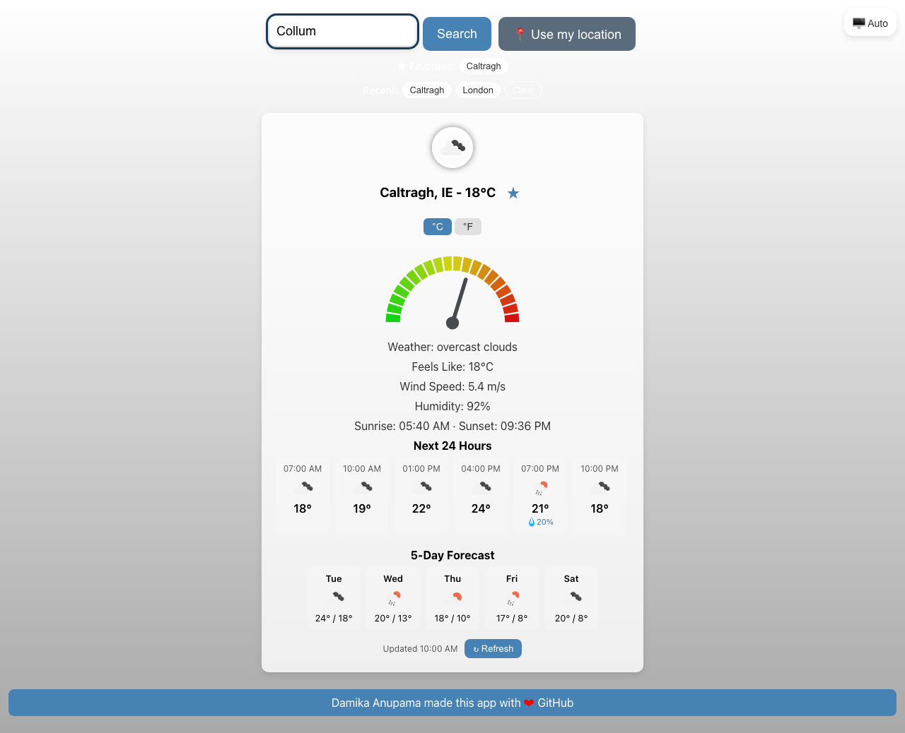
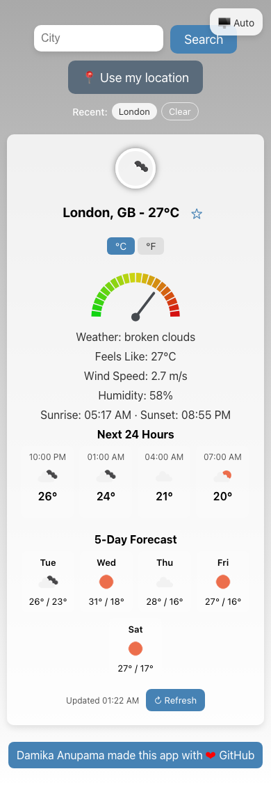

<div align="center">
  <h1> Simple Weather Predicting App 🌦️ </h1>
</div>
<p align="center">
  
</p>

## About

This is a simple weather predicting app built using React.js. It allows users to search for the current weather conditions in any city. The app uses data from the OpenWeather API and provides information like temperature, humidity, wind speed, and more.

**🔗 Live app:** https://Damika-s-Play-Ground.github.io/Simple-Weather-Predicting-App/

---

## Features

- **Search by City**: Look up the current weather in any city.
- **Use My Location**: One-tap weather for your current position via the Geolocation API.
- **Recent Searches**: Recently viewed cities are saved (localStorage) as quick-access chips.
- **5-Day Forecast**: Daily high/low cards summarising the days ahead.
- **°C / °F Toggle**: Switch temperature units instantly without re-fetching.
- **Dynamic Backgrounds**: Themed backgrounds for clear, clouds, rain, drizzle, snow, thunderstorm and mist/fog, with a sensible default.
- **Weather Icons**: Visual representations of the current weather.
- **Gauge Meter**: A gauge meter showing the temperature range.
- **Resilient UX**: Inline loading, empty, and error states (no more `alert()`), plus trimmed/guarded searches.
- **Accessible & Responsive**: `aria-live` results, labelled controls, and a layout that works on desktop and mobile.

---

## Screenshots

| Desktop                                                              | Mobile                                                                     |
| -------------------------------------------------------------------- | -------------------------------------------------------------------------- |
|  |  |

---

## Tech Stack

- React 18 + Vite
- Vitest + React Testing Library
- Axios
- OpenWeather API
- GitHub Pages (CI auto-deploy)

---

## Installation and Setup

### Clone the repository

```bash
git clone https://github.com/Damika-s-Play-Ground/Simple-Weather-Predicting-App.git
```

Navigate to the project directory

```bash
cd Simple-Weather-Predicting-App
```

Install dependencies

```bash
npm install
```

### Configure your API key

The app reads the OpenWeather API key from an environment variable. Copy the
example file and add your own key:

```bash
cp .env.example .env
```

Then edit `.env` and set `VITE_OWM_KEY` to a key from
[OpenWeather](https://home.openweathermap.org/api_keys). `.env` is gitignored so
your key is never committed.

> ⚠️ **Security note:** an OpenWeather key was previously hardcoded in the source
> and pushed to this public repo. That key is compromised and **must be rotated** —
> generate a new one and revoke the old key in your OpenWeather dashboard. Also
> note that Vite inlines `VITE_*` values into the client bundle
> at build time, so any key shipped to the browser is inherently public; use a
> restricted free-tier key.

Start the development server

```bash
npm run dev
```

## Deployment

The app is deployed to **GitHub Pages** from the `gh-pages` branch. To publish
the current `main`:

```bash
npm run deploy
```

This builds the app and pushes `dist/` to `gh-pages`. The live site:
https://Damika-s-Play-Ground.github.io/Simple-Weather-Predicting-App/

### Continuous deployment

Pushes to `main` also trigger `.github/workflows/ci.yml`, which runs the tests
and build and then auto-publishes to the `gh-pages` branch — so the live site
stays up to date without a manual `npm run deploy`. The build reads the
`REACT_APP_OWM_KEY` **repository secret** (mapped to `VITE_OWM_KEY` at build time) (Settings → Secrets and variables →
Actions).

## Contributing

Pull requests are welcome. For major changes, please open an issue first to discuss what you would like to change.

## License

This project is licensed under the MIT License - see the [LICENSE](./LICENSE) file for details.
